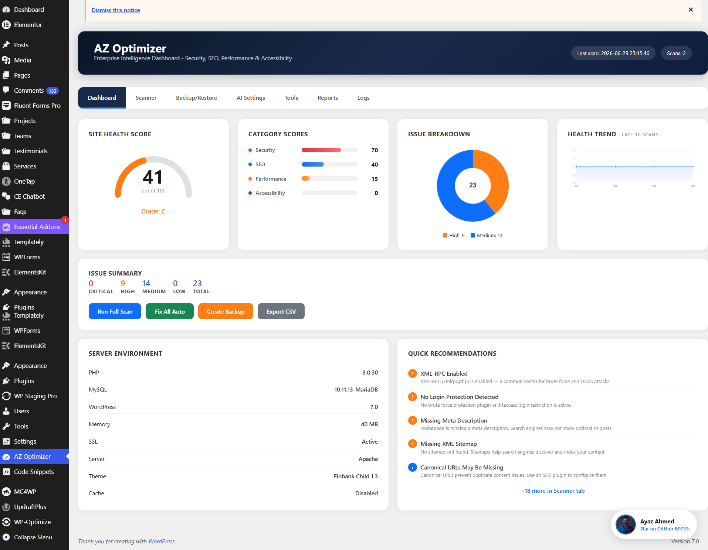

# AZ Optimizer — WordPress Intelligence Dashboard

> **Security · SEO · Performance · Accessibility — All in One Plugin**

---

## 🚀 Overview

**AZ Optimizer** is an enterprise-grade WordPress all-in-one optimization plugin that scans, detects, and fixes **35+ common issues** across Security, SEO, Performance, and Accessibility. Built for developers and site owners who want a **single dashboard** to monitor and improve their WordPress site health.

### ✨ Key Features

| Feature | Details |
|---------|---------|
| **Health Score Engine** | Real-time 0–100 score with A–F grading across 4 categories |
| **Security Scanner** | Headers audit, SSL check, file permissions, XML-RPC, login protection, core integrity |
| **SEO Auditor** | Meta tags, sitemap, robots.txt, canonical URLs, schema markup, Open Graph |
| **Performance Tuner** | PHP/MySQL checks, GZIP, caching, CDN, cron health, memory/upload limits, DB bloat |
| **Accessibility Fixer** | Alt text, color contrast, heading order, touch targets, skip links, landmarks, ARIA |
| **One-Click Auto-Fix** | Applies 20+ automated fixes with a single button |
| **Full Site Optimize** | Installs Rank Math + Smush + Asset CleanUp, configures them, runs all fixes, generates sitemap |
| **AI Analysis** | Connect any OpenAI-compatible API (OpenAI, Groq, Together, Azure, etc.) for smart recommendations |
| **Plugin Installer** | One-click install of Rank Math SEO, Smush, Asset CleanUp |
| **Backup Manager** | Create, restore, and delete backups of .htaccess, robots.txt, wp-config.php |
| **Database Optimizer** | Clean revisions, spam, transients, drafts, trash + optimize all tables |
| **Scheduled Scans** | Daily or weekly automated scans with email alerts for critical issues |
| **CSV Export** | Download full scan reports |
| **Email Reports** | Send summary reports to any address |
| **Health Trend Chart** | Track score history over time |
| **Server Monitor** | View PHP, MySQL, WP, memory, SSL, server software at a glance |

---

## 📋 What AZ Optimizer Checks

### 🔒 Security (9 checks)
- Missing Security Headers (CSP, HSTS, X-Frame-Options, X-Content-Type-Options, Referrer-Policy, Permissions-Policy)
- HTTPS Redirect missing/commented
- SSL Certificate expiry check
- Insecure file permissions (wp-config.php, .htaccess)
- Default "admin" username
- XML-RPC enabled (brute force vector)
- WP_DEBUG enabled on production
- No login/brute force protection
- Core file tampering detection

### 📈 SEO (6 checks)
- Missing robots.txt or missing Sitemap directive
- robots.txt blocking all crawlers (Disallow: /)
- Missing meta description on homepage
- Missing XML sitemap
- Canonical URLs not configured
- No Schema.org markup / Open Graph tags

### ⚡ Performance (14 checks)
- PHP version outdated
- MySQL version outdated
- WP memory limit too low
- Upload max / post max size issues
- GZIP compression not enabled
- No caching plugin detected
- Excessive cron events
- Heartbeat API running at default
- Database bloat (revisions, spam, transients, auto-drafts, trash)
- Render-blocking resources
- Unused/inactive plugins
- Large unoptimized images
- Excessive external HTTP requests
- Orphaned post meta

### ♿ Accessibility (8 checks)
- Images missing alt text
- Insufficient color contrast
- Heading order not sequential
- Touch targets too small
- Skip links not focusable
- Missing `<main>` landmark
- No visible focus indicators
- Interactive elements missing accessible names
- Form elements missing labels

---

## 🖥️ Dashboard Preview

The dashboard features:
- **Health Score Gauge** — live 0–100 score with letter grade
- **Category Score Bars** — Security, SEO, Performance, Accessibility
- **Issue Breakdown Pie Chart** — distribution by severity
- **Health Trend Line Chart** — track score changes over time
- **Server Environment Panel** — PHP, MySQL, WP, SSL, memory, server
- **Quick Recommendations** — top 5 issues with severity badges
- **One-click actions** — Scan, Fix All, Backup, Export

---

## 🔧 Installation

### Via WordPress Admin
1. Download the plugin ZIP
2. Go to **Plugins → Add New → Upload Plugin**
3. Upload the ZIP and click **Activate**

### Manual Installation
1. Copy the `az-optimizer` folder to `/wp-content/plugins/`
2. Go to **Plugins → Installed Plugins**
3. Activate **AZ Optimizer**

---

## 📖 How to Use

### 1. Run Your First Scan
Go to **AZ Optimizer** in the WordPress admin menu. Click **Run Full Scan** on the Dashboard tab.

### 2. Review Issues
Switch to the **Scanner** tab to see all detected issues. Use the Type/Severity filters to narrow down.

### 3. Auto-Fix Everything
Click **Fix All Auto** to automatically apply all fixable security headers, rewrite rules, database cleanup, and accessibility improvements.

### 4. Full Site Optimization (Recommended)
Go to **Tools → Run Full Site Optimization**. This will:
- Install Rank Math SEO, Smush, and Asset CleanUp
- Configure Rank Math (titles, sitemaps, schema, breadcrumbs)
- Configure Smush (auto-compression, WebP, resizing)
- Apply all 20+ auto-fixes
- Generate XML sitemap
- Clean junk files and optimize database

### 5. Configure AI Analysis (Optional)
Go to **AI Settings**, enter your OpenAI API key (or any OpenAI-compatible provider's key + base URL), click **Fetch Models** to load available models, then analyze your site with AI.

### 6. Schedule Scans
Go to **Reports → Scheduled Scans** to enable daily/weekly automatic scans with email alerts for critical issues.

---

## ⚙️ Requirements

- WordPress 5.6+
- PHP 7.4+
- MySQL 5.6+

---

## 🤝 Contributing

This plugin is open source. Contributions, issues, and feature requests are welcome!

1. Fork the repository
2. Create your feature branch (`git checkout -b feature/amazing-feature`)
3. Commit your changes (`git commit -m 'Add amazing feature'`)
4. Push to the branch (`git push origin feature/amazing-feature`)
5. Open a Pull Request

---

## 📄 License

GPL v2 or later — see [LICENSE](LICENSE) for details.

---

## 👨‍💻 Author

**Ayaz Ahmed**  

> If you find this plugin useful, please ⭐ star the repository on GitHub!
